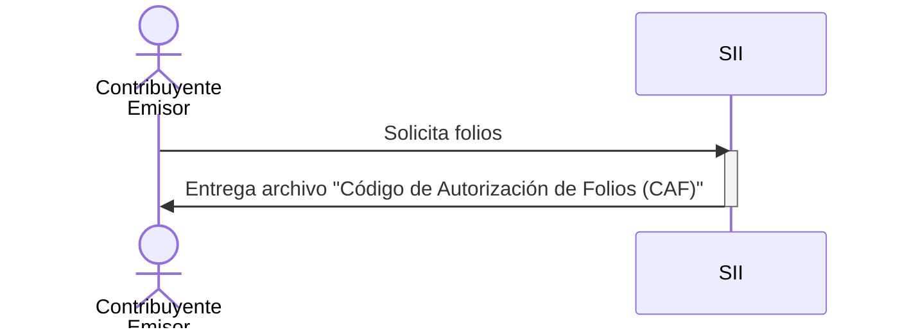
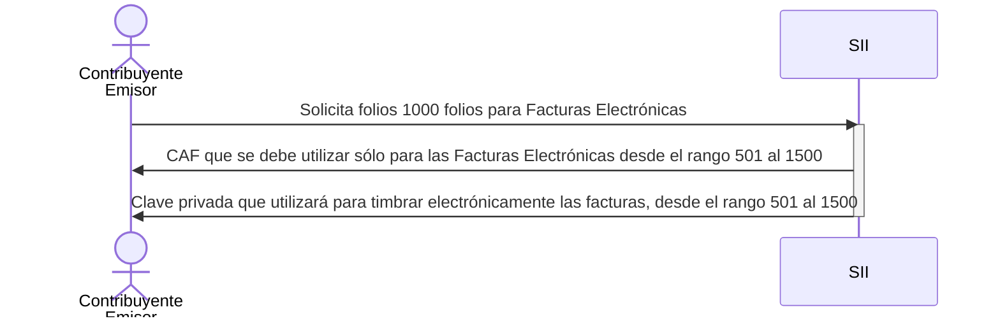

[[_TOC_]]

# CAFs

```mermaid
sequenceDiagram

    actor       Contribuyente as Contribuyente<br/>Emisor
    participant SII

    Contribuyente->>SII: Solicita folios
    activate SII
    
    SII->>Contribuyente: Entrega archivo "Código de Autorización de Folios (CAF)"
    deactivate SII

```

Ejemplo

```mermaid
sequenceDiagram

    actor       Contribuyente as Contribuyente<br/>Emisor
    participant SII

    Contribuyente->>SII: Solicita folios 1000 folios para Facturas Electrónicas
    activate SII
    
    SII->>Contribuyente: CAF que se debe utilizar sólo para las Facturas Electrónicas desde el rango 501 al 1500

    SII->>Contribuyente: Clave privada que utilizará para timbrar electrónicamente las facturas, desde el rango 501 al 1500
    
    deactivate SII

```

Fuente: [https://www.sii.cl/preguntas_frecuentes/catastro/001_012_2020.htm](https://www.sii.cl/preguntas_frecuentes/catastro/001_012_2020.htm)

