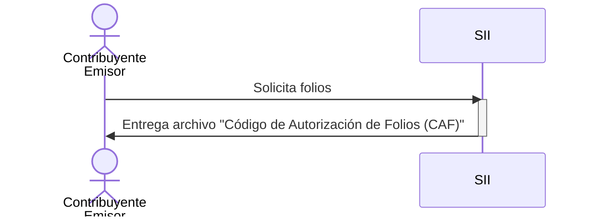
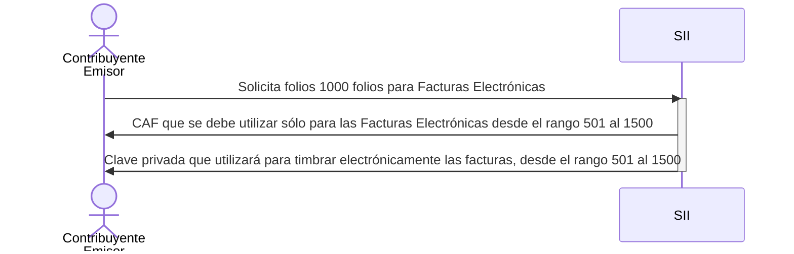

[[_TOC_]]

# SII-UML

Documentación UML no oficial sobre temas del SII de Chile.

* [https://mermaid.js.org](https://mermaid.js.org)
* [https://www.sii.cl/](https://www.sii.cl/)

# CAFs

Ejemplo

Fuente: [https://www.sii.cl/preguntas_frecuentes/catastro/001_012_2020.htm](https://www.sii.cl/preguntas_frecuentes/catastro/001_012_2020.htm)

