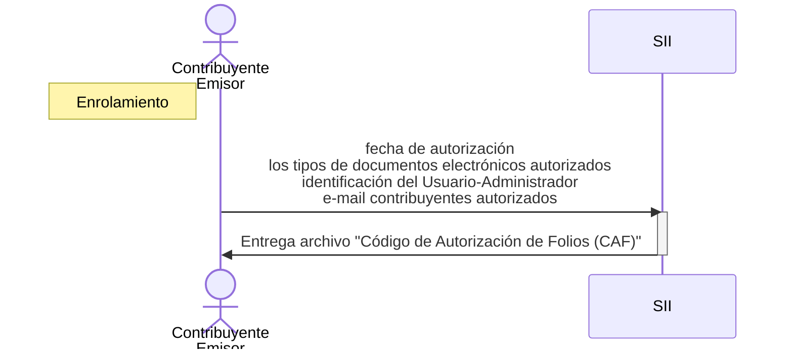

# Instructivo Técnico Factura Electrónica

## Actividades Previas a la Emisión de Documentos

Fuente [https://www.sii.cl/factura_electronica/factura_mercado/instructivo_emision.pdf](https://www.sii.cl/factura_electronica/factura_mercado/instructivo_emision.pdf)

